# EarBee


## 목차
   1. [프로젝트 목적](#프로젝트-목적)
   2. [사용 기술](#사용-기술)
   3. [수행 도구](#수행-도구)
   4. [설계](#설계)
   5. [기능](#기능)
   6. [테스트](#테스트)
   7. [서버](#서버)
   8. [Properties](#Properties)
   9. [학습](#학습) 
   10. [Oauth2](#Oauth2) 

# 프로젝트 목적

<br>

# 추가
- resource에 business.properties 추가 
- https://www.data.go.kr/data/15081808/openapi.do 에서 활용 신청 후 키 삽입 
    ```
    business.url=https://api.odcloud.kr/api/nts-businessman/v1/status?serviceKey=
    business.encoding=인코딩키
    business.decoding=디코딩키
    ```
- https://business.juso.go.kr/addrlink/openApi/apiReqst.do
   ```
   address.key=인증키
   address.url=https://www.juso.go.kr/addrlink/addrLinkApi.do
   ```    


# 사용 기술


### BackEnd
    
### FrontEnd
    
    
### API
- 국세청_사업자등록정보 진위확인 및 상태조회 서비스
- 주소 기반 산업 지원 서비스 검색 
    
### Server

<br>

# 수행 도구

<br>

# 설계

<br>    

# 기능

<br>

# 테스트

<details>
    <summary>자세히</summary>

### 1. postman
   - restAPI test (확인 완료)   

        

   - 사업자 번호 조회 api test(postman- 확인 완료)   

     

   - 주소 검색 조회 api test (확인 완료)
     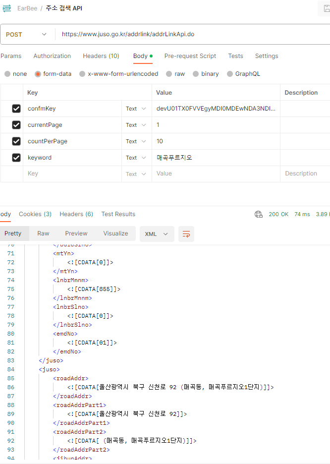
  
   - 네이버 Geocoding api test (확인 완료)
     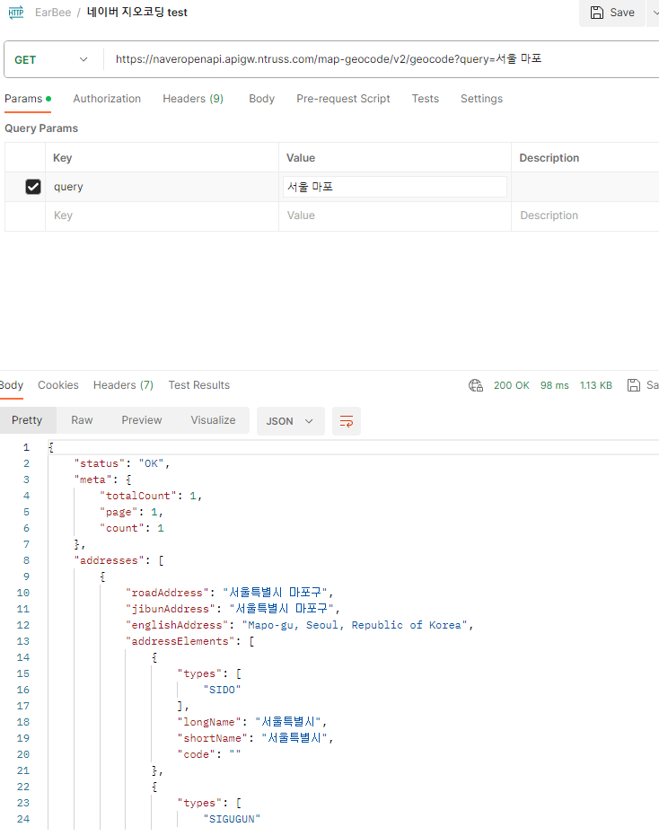

<br>

### JUnit
   - BusinessApiControllerTest
        - checkValue() : properties 내용을 정상적으로 가져오는지 테스트 진행   
     
          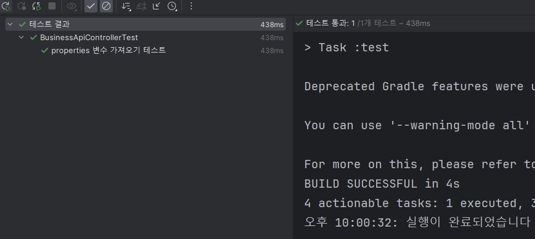   
          
        -  businessSerchNum   
           - request내용이 정상적으로 post로 보내고 결과값을 받는지 확인   
           - testcase는 식별되지 않은 사업자와, 정상적인 사용자로 지정
                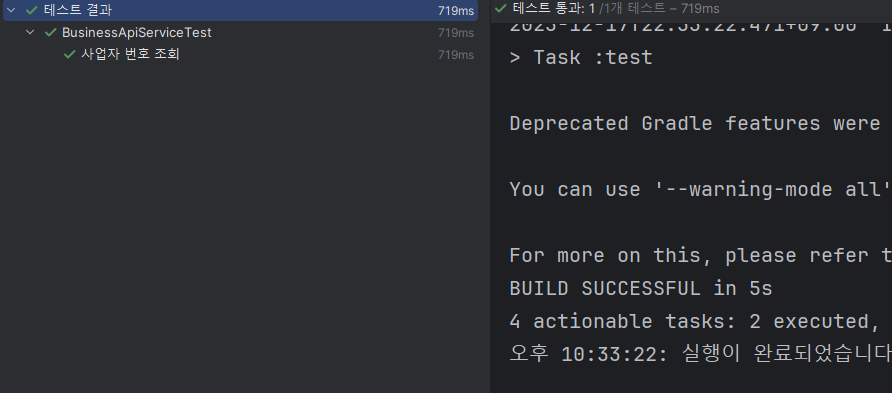


</details>


<br>

# 서버

<br>

# Properties

```
# dbms
spring.datasource.url=jdbc:oracle:thin:@localhost:1521:XE
spring.datasource.driver-class-name=oracle.jdbc.OracleDriver
spring.datasource.username="earbee"
spring.datasource.password="root"

# jsp
spring.mvc.view.prefix=/WEB-INF/views/
spring.mvc.view.suffix=.jsp


# Server port 고정
server.port= 8080

# jsp 변경되면 자동으로 업데이트 지정
server.servlet.jsp.init-parameters.development = true 

```


# 학습
<details>
    <summary>Seoin</summary>

#### JSP    
spring boot에서는 jsp를 사용하기 위해서는 추가적으로 의존성 주입이 필요하다.

- build.gradle
    ```
    // 내장 톰켓에서 jsp인식할 수 있도록 jsp 의존성 삽입
    implementation 'org.apache.tomcat.embed:tomcat-embed-jasper'
    // jstl 의존성 삽입
    implementation 'javax.servlet:jstl:1.2'
    ```
- application.properties
        
    ```
    // view 접두사 ( 경로 설정 )
    spring.mvc.view.prefix=/WEB-INF/views/
        
    // view 접미사 ( 확장자 설정)
    spring.mvc.view.suffix=.jsp
    ```

  <br>


#### properties 
1. properties 변수 
   - 새롭게 만든 properties를 사용하기 위해서는 위치를 알려야함
   - @PropertySource("classpath:business.properties") 사용
    
    &rarr; 정상적으로 변수를 불러옴을 확인


#### 공공 API Connect

1. HttpURLConnection
2. 서비스 코드 
   - postman 또는 웹 브라우저에서는 인증키를 Encoding키 사용
   - spring server에서는 인증키를 Decoding 사용 (로컬은 encoding key)

#### 버그
1. springSecurity 설정 클래스 인식 불가 : package가 com.eb.earbee인데 eb 패키지에 security를 생성한 것을 발견 -> 수정 완료
2. 시큐리티 로그인 후 메인페이지 접속 시 로그인 해제 : UserDetails가 아닌 User 객체로 인증된 유저 정보를 받을려고 해서 null 발생 -> 수정 완료   
3. img의 src가 너무 길어 치환하기 위해 WebConfig를 생성하였지만 정상적으로 작동하지 않고 alt 발생 : @Configuration 추가하지 않음 -> 수정 완료 
4. google oauth2 로그인시 google redirect_uri_mismatch 발생 : port나 uri 확인 -> 수정 완료

</details>


```properties
#Server port
server.port= 8080

        # encoding
server.servlet.encoding.charset=UTF-8
server.servlet.encoding.force=true

spring.jpa.defer-datasource-initialization=true


# JPA
spring.jpa.properties.hibernate.format_sql=true

# JPA
logging.level.org.hibernate.SQL=DEBUG
        # JPA
logging.level.org.hibernate.type.descriptor.sql.BasicBinder=TRACE

# postgres
spring.datasource.url=jdbc:postgresql://localhost:5432/firstproject_db
spring.datasource.username=postgres
spring.datasource.password=postgres

#dbms oracle
#spring.datasource.driver-class-name=oracle.jdbc.OracleDriver
#spring.datasource.url=jdbc:oracle:thin:@localhost:1521:xe
#spring.datasource.username="EARBEE"
        #spring.datasource.password="root"
        #spring.jpa.properties.hibernate.dialect=org.hibernate.dialect.OracleDialect

# init
spring.sql.init.data-locations=classpath:data.sql


# init €
        #spring.sql.init.mode=always

# init
spring.jpa.hibernate.ddl-auto=create-drop


# jsp
#spring.mvc.view.prefix=/WEB-INF/views/
        #spring.mvc.view.suffix=.jsp


business.url=https://api.odcloud.kr/api/nts-businessman/v1/status?serviceKey=
business.encoding=XNM%2FAHJB%2B68HV79cSGOQ%2BDtMs87Gq3gmewT2NdPV8a2uH1uwWaF2k3L1CjEypfOMtotlgr%2FG%2BYhyNtDU8DxZuw%3D%3D
business.decoding=XNM/AHJB+68HV79cSGOQ+DtMs87Gq3gmewT2NdPV8a2uH1uwWaF2k3L1CjEypfOMtotlgr/G+YhyNtDU8DxZuw==
address.key=devU01TX0FVVEgyMDI0MDQwNzIxNDYzMDExNDY2OTM=
address.url=https://www.juso.go.kr/addrlink/addrLinkApi.do
#naver.client.id=apzr0ref1b
#naver.client.secret=PmMbwcBr39Zonrb2nWlmtmKeXhNZKMzvNaveuuUO

```

# Oauth2
1. 사전 단계 : MavenRepo에서 Oauth2 client 맘에 드는 버전 가져오기
```properties
// https://mvnrepository.com/artifact/org.springframework.security/spring-security-oauth2-client
implementation group: 'org.springframework.security', name: 'spring-security-oauth2-client', version: '6.2.3' 
```

2. google:
   1. Google API Console 접속
   2. API 및 서비스 접속 
   
   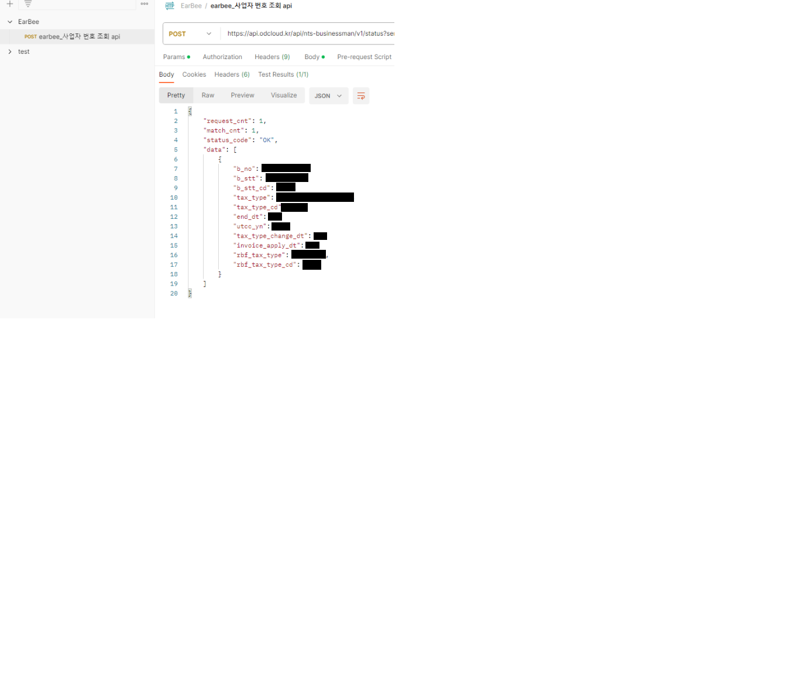
   3. 프로젝트 생성
   
   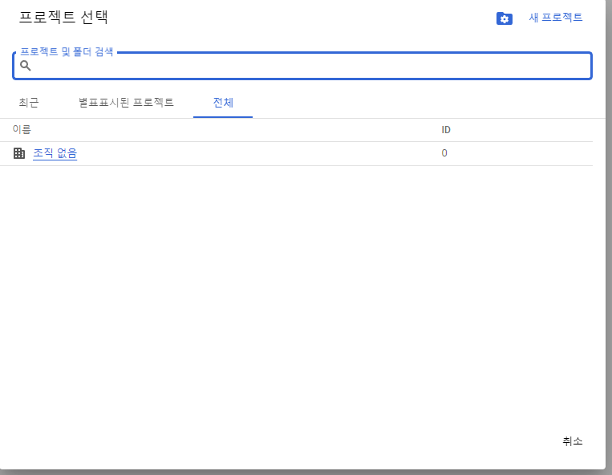

   4. Oauth2 동의 화면 이동 후 External 클릭 후 만들기
   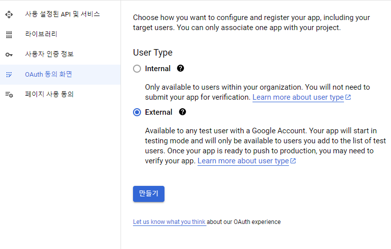
   5. 필요한 정보 기입 후 만들기
   
   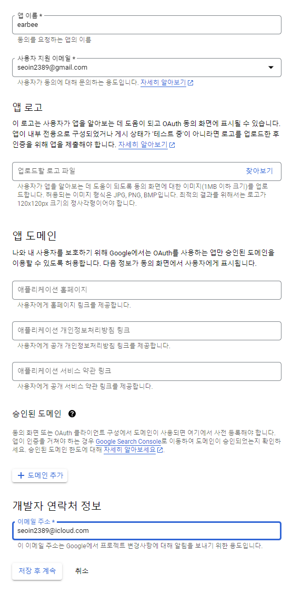
   6. 사용자 인증 정보 이동
   
   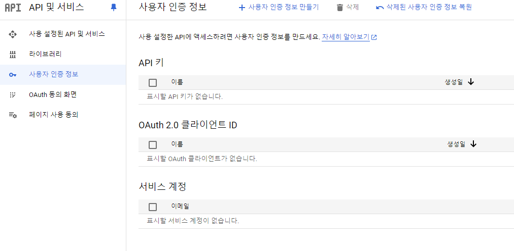
   7. 사용자 인증 정보 만들기 -> Oauth 클라이언트 ID 생성
   
   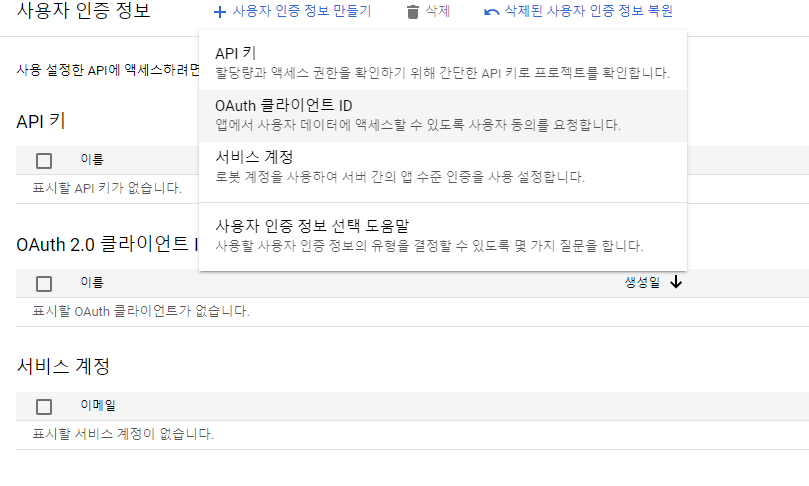

    8. 프로젝트 이름과 승인된 리다이렉션 URI 지정 후 생성 
        - /login/oauth2/code 까지는 고정값 prefix와 subfix는 자유롭게 지정
        - 이 리다이렉션 uri에 대한 controller를 만들 필요가 없음 -> 라이브러리가 알아서 처리
    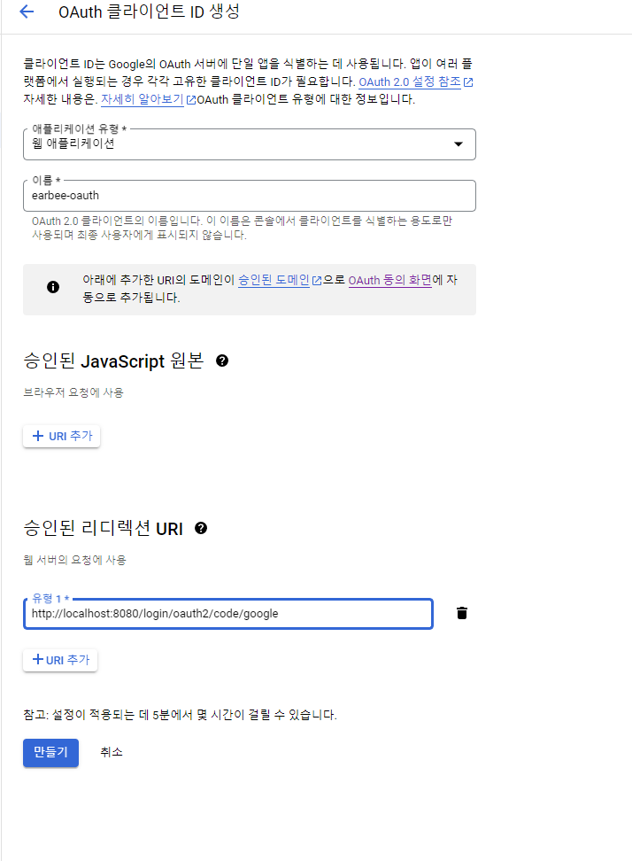
    

    9. yml 파일에 clientId&PWD를 작성
       ```properties
        security:
           oauth2:
               client:
               registration:
                  google:
                    client-id:
                    client-secret:
                    scope:
                      - email
                      - profile
       ```
   10. 전송 uri는 /oauth2/authorization/google 로 고정 
       - 바꿀 수 없음 : test 시 404 정상
       - SecurityConfig oauth2 추가
   
         ```
            <a href="/oauth2/authorization/google"></a>
         ```

 

